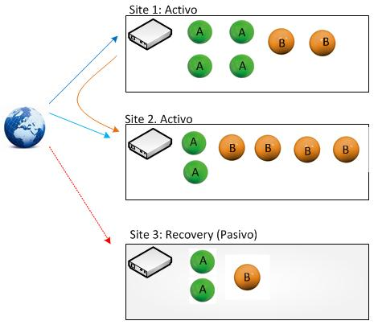

**TEMA 4: Balanceo de carga**


**Ejercicio T4.1:
Buscar información sobre cuánto costaría en la actualidad un mainframe. Comparar precio y potencia entre esa máquina y una granja web de unas prestaciones similares.**

Debido a que esa información es exclusiva y no la proporcionan fácilmente, el único mainframe que he encontrado es el "zEnterprise 114" de IBM valorado en 410 mil dólares que incluye tres años de mantenimiento y SW de virtualización.

El mainframe citado anteriormente dispone de 168 unidades de procesamiento y su capacidad máxima de RAM es de 10144 GiB.

**Ejercicio T4.2:
Buscar información sobre precio y características de balanceadores hardware específicos. Compara las prestaciones que ofrecen unos y otros.**

No he encontrado información pública de balanceadores de carga hardware. He dejado mis datos en varias páginas como f5 y kemptechnologies pero no me han enviado información al respecto.

**Ejercicio T4.3:
Buscar información sobre los métodos de balanceo que implementan los dispositivos recogidos en el ejercicio 4.2**

Imposible de realizar sin poder hacer el ejercicio anterior aunque he buscado los métodos de balanceo más utilizados y normalmente se usa Round-Robin.

**Ejercicio T4.4:
Instala y configura en una máquina virtual el balanceador ZenLoadBalancer.**

En https://sourceforge.net/projects/zenloadbalancer/files/latest/download disponemos el archivo ISO que pesa 347 MB que debemos instalar en la máquina linux. Iniciada la instalación y la configuración, accedemos con https://192.168.1.6:444

ZenLoadBalancer dispone de interfaz gráfica que hacen más amigable su uso, claro está, si disponemos en nuestro Server Linux de su propia interfaz gráfica.

**Ejercicio T4.5:
Probar las diferentes maneras de redirección HTTP.
¿Cuál es adecuada y cuál no lo es para hacer balanceo de carga global? ¿Por qué?**

El tipo de redirección (301 ó 302) indica si es temporal o permanente. Si queremos indicar a buscadores u otros visitantes de la página que una redirección es temporal utilizamos 302 y si queremos fijar la redirección de manera permanente utilizamos 301.

Para hacer balanceo de carga sería mejor usar 302 ya que la redirección sería temporal dependiendo de la carga de los servidores.

**Ejercicio T4.6:
Buscar información sobre los bloques de IP para los distintos países o continentes.
Implementar en JavaScript o PHP la detección de la zona desde donde se conecta un usuario**

Cada país tiene un rango de ips asignado, en la siguiente web se pueden ver los rangos asignados:

```
https://www.countryipblocks.net/country_selection.php
```

Un posible PHP que realiza ese trabajo seria:

```
<?php
// Cogemos la IP del usuario del array que nos pasa el servidor
$user_ip = $_SERVER['REMOTE_ADDR'];

// Iniciamos el handler de CURL y le pasamos la URL de la API externa
$ch = curl_init("http://api.hostip.info/country.php?ip=$user_ip");

// Con este comando le pedimos a CURL que, en vez de mostrar
// el resultado en pantalla, nos lo devuelva como una variable
curl_setopt($ch, CURLOPT_RETURNTRANSFER, true);

// Y simplemente hacemos la petición HTTP.
$country_code = curl_exec($ch);

// Y para muestra, un botón, vamos a probar que funciona bien:
echo "Este adorable servidor ha detectado que tu código de país es... $country_code";
?>
```


**Ejercicio T4.7:
Buscar información sobre métodos y herramientas para implementar GSLB.**

Se trata de situar en cada uno de los sites un dispositivo con capacidad GSLB (casi todos los fabricante importantes tienen modelos de este tipo, CISCO, F5, RADWARE, etc.), de tal manera, que los diferentes dispositivos GSLB hablan entre ellos para decidir que Site debe atender a un determinado usuario.

La decisión de a que Datacenter se debe dirigir a un usuario se puede tomar en base a uno o diferentes criterios, por ejemplo:

- Carga: en función  de la carga que tenga el Datacenter se envía a uno u otro.
- Latencia: en función de los tiempos de respuesta al usuario.
- Vector distancia: en función de los bloques de direccionamiento.
- DNS: implementando una Round Robin.
- Etc.


